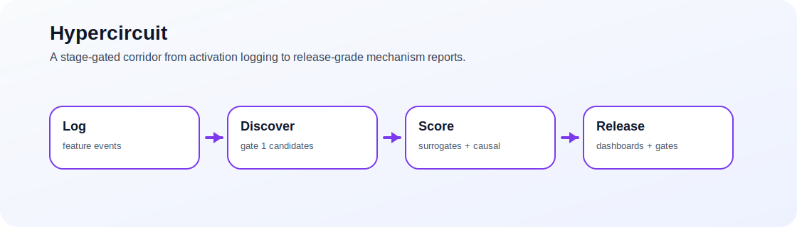

# Hypercircuit
> Stage-gated higher-order interpretability workflow for logging, discovery, surrogate scoring, causal evaluation, edits, and release-ready reports.

   

Hypercircuit exists to keep circuit discovery honest by splitting the corridor into explicit stages that emit explicit artifacts instead of hiding everything behind one score.



## 60-second demo
```bash
python -m venv .venv
source .venv/bin/activate
pip install -e .[dev]
python -m hypercircuit.cli.run_log --config configs/base.yaml configs/logging.yaml
python -m hypercircuit.cli.run_discovery --config configs/base.yaml configs/discovery.yaml
```

Produces stage artifacts under `runs/` such as:
- `manifest.json`
- `events_manifest.json`
- `candidates_manifest.json`
- `gate1_report.json`

## Choose your path
- I want a mock run now: [60-second demo](#60-second-demo) · [Quickstart](#quickstart)
- I want the stage map: [Workflow corridor](#workflow-corridor) · [Artifacts](#artifacts)
- I want real-model logging: [Mock mode vs real mode](#mock-mode-vs-real-mode)
- I want to extend it: [Status](#status) · [Development](#development)

## Why this exists
Hypercircuit treats mechanism discovery as a corridor, not a one-shot guess. Logging, candidate mining, surrogate fitting, causal evaluation, edit evaluation, labeling, and release packaging each get their own artifact and their own gate.

## What this is / isn't
✅ Is: an SAE-first workflow scaffold with deterministic mock mode, optional real-model logging, and stage-specific artifacts  
✅ Is: a place to measure how candidates survive increasingly strong tests  
❌ Isn't: a claim that the heavy algorithms are all done or final  
❌ Isn't: only a dashboard layer around hidden internals

## Quickstart
Mock corridor:
```bash
python -m hypercircuit.cli.run_log --config configs/base.yaml configs/logging.yaml
python -m hypercircuit.cli.run_discovery --config configs/base.yaml configs/discovery.yaml
python -m hypercircuit.cli.run_surrogate --config configs/base.yaml configs/surrogate.yaml configs/dictionary.yaml
python -m hypercircuit.cli.run_causal_eval --config configs/base.yaml configs/causal.yaml configs/dictionary.yaml
python -m hypercircuit.cli.run_edit_eval --config configs/base.yaml configs/editing.yaml
```

Optional real-model logging:
```bash
pip install -e .[dev,model]
python -m hypercircuit.cli.run_log \
  --config configs/base.yaml configs/logging.yaml \
  --override logging.mode=real \
  --override model.hf_model=sshleifer/tiny-gpt2 \
  --override dataset.source=hf \
  --override dataset.hf_name=imdb
```

## Workflow corridor
- Log: capture activations or mock events
- Discover: build higher-order candidate sets and Gate 1 reports
- Surrogate: fit and calibrate stage-specific predictors
- Causal: evaluate necessity/robustness and emit later gates
- Edit: simulate or evaluate edits
- Release: label, dashboard, reconcile, and package

## Mock mode vs real mode
- Mock mode is deterministic and best for schema, registry, and gate plumbing.
- Real mode adds optional dependencies and local model weights.
- Keep the two stories distinct: mock proves corridor integrity; real mode proves the corridor can attach to an actual model.

## Artifacts
Existing runs already show the shape of the corridor:
- `gate1_report.json`
- `gate2_report.json`
- `gate3_report.json`
- `gate4_report.json`
- dashboard summaries and label reports
- release manifests and robustness summaries

## Docs
- [CONTRACTS_AND_SCHEMAS.md](docs/CONTRACTS_AND_SCHEMAS.md)
- [ROADMAP_V1_to_V2.md](docs/ROADMAP_V1_to_V2.md)
- [SCALING_RECOMMENDATION.md](docs/SCALING_RECOMMENDATION.md)

## Development
```bash
pytest
ruff check .
mypy src
```

## Status
- Best described as an active scaffold with real run artifacts and deliberate stage boundaries.
- Mock mode is the stable story today.
- Real-model logging is available but intentionally optional.

## License
[BSD-3-Clause-like repo license](LICENSE)
